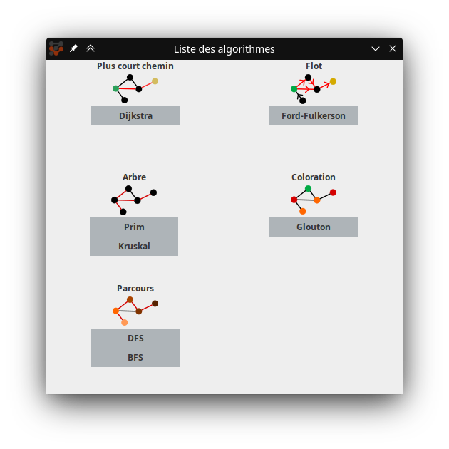
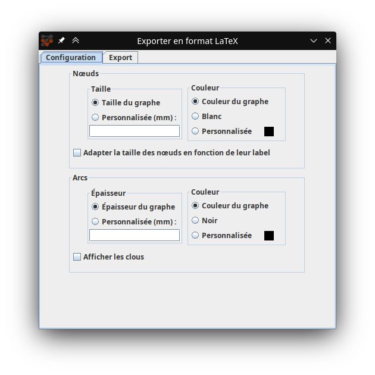

# Documentation utilisateur INFOREG

## Sommaire

- [1. Prérequis et exécution](#1-prérequis-et-exécution)
- [2. Interface](#2-interface)
- [3. Choix du type de graphe](#3-choix-du-type-de-graphe)
- [4. Création du graphe](#4-création-du-graphe)
  - [4.1 Ajout d'éléments](#41-ajout-déléments)
  - [4.2 Modification](#42-modification)
  - [4.3 Affichage](#43-affichage)
  - [4.4 Historique](#44-historique)
- [5. Traitement algorithmique](#5-traitement-algorithmique)
  - [5.1 Choix d'un algorithme](#51-choix-dun-algorithme)
  - [5.2 Traitement](#52-traitement)
- [6. Sauvegarde et chargement](#6-sauvegarde-et-chargement)
  - [6.1 Sauvegarde](#61-sauvegarde)
  - [6.2 Chargement](#62-chargement)
- [7. Exportation en d'autres formats](#7-exportation-en-dautres-formats)
  - [7.1 Image PNG](#71-image-png)
  - [7.2 Export LaTeX](#72-export-latex)
    
<div class="page"/>

## 1. Prérequis et exécution

Ce logiciel requiert Java 16 ou supérieur.
Le .jar du logiciel est autonome et ne nécessite pas d'installation particulière.  

Pour lancer Inforeg, double-cliquer sur l'exécutable .jar. Une fenêtre de démarrage doit apparaître.


## 2. Interface

<div align="center">
    <div>Fenêtre de démarrage :</div>
    
</div>

<div align="center">
    <div>Fenêtre principale :</div>
    
</div>

<div class="page"/>

## 3. Choix du type de graphe

Le choix du type de graphe se fait au lancement du logiciel, dans la fenêtre de démarrage.

Il est possible de choisir si un graphe est :
- pondéré : affichage de pondération sur les arcs.
- orienté : affichage de flèche sur un arc qui indique son sens.


## 4. Création du graphe

### 4.1 Ajout d'éléments

Un graphe est constitué visuellement de 3 éléments :
- des nœuds
- des arcs entre les nœuds
- des clous qui scindent les arcs en segments

Chaque ajout se fait en cliquant sur le bouton rectangulaire correspondant dans la zone `Ajouter`.

<div>
  <font size=3><b>Nœud</b></font>
  
</div>

L'ajout d'un nœud se fait avec un clic gauche dans la zone de dessin.  
Lorsque ce bouton est sélectionné, un nœud peut être déplacé en maintenant clic gauche et peut être supprimé en avec un double-clic gauche.

<div>
  <font size=3><b>Arc</b></font>
  
</div>

L'ajout d'un arc nécessite de cliquer sur deux nœuds. Le 1er nœud cliqué a un contour colorié temporairement pour indiquer sa sélection.  
- Si le graphe est orienté, le sens de l'arc se fera du 1er nœud vers le second.
- Si le même nœud est cliqué deux fois, un arc en forme de cercle apparaîtra pour indiquer la présence d'une boucle. Ce type d'arc ne peut pas avoir plus d'un seul clou.

Lorsque ce bouton est sélectionné, un arc peut être supprimé avec un double-clic gauche.

<div>
  <font size=3><b>Clou</b></font>
  
</div>

Les clous permettent de modifier le chemin d'un arc en le découpant en segments. Cela permet par exemple d'éviter que des arcs ne se croisent.

L'ajout d'un clou nécessite de cliquer sur un arc existant. Il n'y a pas de limite de clous par arc, sauf pour les boucles qui sont limitées à un seul clou.  
Lorsque ce bouton est sélectionné, un clou peut être déplacé en maintenant clic gauche et peut être supprimé avec un double-clic gauche.
> **Remarque**  
> Les boucles contiennent un clou lors de leur création. Ce dernier ne peut pas être supprimé.

<div class="page"/>

### 4.2 Modification

Il est possible de modifier certaines caractéristiques des éléments du graphe pour le rendre plus lisible.

<div>
  <font size=3><b>Label</b></font>
  
</div>

Chaque nœud est créé avec un label qui correspond par défaut à son ordre d'ajout. Cependant, il est possible de le modifier par la suite :
- à l'aide du bouton label 
  puis en cliquant sur les nœuds à renommer
- avec un clic droit sur le nœud puis en sélectionnant sur `Renommer`

>**⚠️ Attention**  
>Bien qu'il soit possible de nommer plusieurs nœuds avec le même label sans affecter le traitement algorithmique, les résultats affichés désignent les nœuds avec leur label et peuvent être ambigus.

<div>
  <font size=3><b>Couleur</b></font>
  
</div>

La couleur d'un nœud ou d'un arc peut être modifiée :
- à l'aide du bouton pinceau 
  puis en cliquant sur les nœuds/arcs à colorier. La couleur appliquée est celle du sélectionneur de couleur   dans la barre d'outils en dessous du bouton pinceau. Il est possible d'ouvrir le sélectionneur de couleur avec le raccourci `ALT + O`.
- avec un clic droit sur le nœud/arc puis en sélectionnant sur `Couleur`

### 4.3 Affichage

La zone affichée à l'écran peut être modifiée pour faciliter la création de graphe ou pour parcourir des graphes complexes.

<div>
  <font size=3><b>Déplacement</b></font>
  
</div>

Le bouton `déplacement` permet de déplacer le cadre de la zone de dessin dans le repère du graphe. Un déplacement s'effectue lorsque ce bouton est sélectionné, puis en maintenant clic gauche et en déplaçant la souris.

<div>
  <font size=3><b>Sélectionner</b></font>
  
</div>

Le bouton `sélectionner` permet de sélectionner des éléments du graphe :
- Si un nœud ou un clou est cliqué directement, il est possible de le déplacer en maintenant clic gauche. 

- Si une zone vide du graphe est cliquée, une zone de sélection peut être dessinée en maintenant clic gauche. Les éléments sélectionnés par cette zone deviennent verts. Une fois la souris relâchée, il est possible de :
  - déplacer les éléments en cliquant sur l'un d'entre eux et maintenir clique gauche.
  - supprimer les éléments en appuyant sur `suppr`.

<div>
  <font size=3><b>Zoom</b></font>
</div>

Un slider en bas à droite permet de régler le niveau de zoom. Lorsqu'il est modifié, le zoom se fait par rapport au centre de la zone de dessin.

Le bouton  à gauche du slider permet de faire un zoom automatique centré sur le graphe.

### 4.4 Historique

Les boutons  et  situés en haut à droite de la fenêtre permettent de revenir en arrière ou en avant d'une étape de modification du graphe.

## 5. Traitement algorithmique

### 5.1 Choix d'un algorithme

Dans la barre d'outils à gauche, cliquer sur la zone
 (juste en dessous de `Connexe`). Une fenêtre contenant la liste des algorithmes disponibles classés par catégorie s'ouvre :

<div align="center">
    
</div>

Cliquer sur l'algorithme souhaité. La fenêtre se ferme et le nom de l'algorithme sélectionné apparaît dans la zone cliquée précédemment.


<div class="page"/>

### 5.2 Traitement

Pour lancer l'algorithme sélectionné, cliquer sur le bouton 
en-dessous de la zone avec le nom de l'algorithme.

En fonction de l'algorithme, il est possible de devoir suivre des instructions supplémentaires juste après le lancement (par exemple, choisir un nœud de départ et un nœud d'arrivée). Ces instructions s'affichent en haut de la zone de dessin.

Plusieurs options sont disponibles avant le lancement de l'algorithme :
- La case `Pas à pas` permet (si cochée) de visualiser le fonctionnement de l'algorithme et de parcourir les différentes étapes avec les boutons  (ces boutons s'affichent après avoir lancé l'algorithme).
- La case `Départ auto` peut apparaître en fonction de l'algorithme sélectionné. Si elle est cochée, le premier nœud placé sera sélectionné automatiquement comme nœud de départ.

<div>
  <font size=3><b>Réinitialisation des couleurs d'un graphe</b></font>
  
</div>


Le bouton 
permet d'effacer les modifications visuelles générées pendant le traitement (couleur des nœuds et des arcs). Il n'est pas nécessaire de cliquer sur ce bouton après chaque traitement pour pouvoir en relancer un suivant (la réinitialisation est automatique au lancement d'un algorithme).

## 6. Sauvegarde et chargement

### 6.1 Sauvegarde

Inforeg sauvegarde un graphe dans un fichier texte brut avec l'extension `.inforeg`.

La sauvegarde du graphe se fait par le raccourci `CTRL+S` ou par le menu `Fichier > Enregistrer` en haut de la fenêtre.  
- Si le graphe est nouveau (i.e. n'a pas été chargé depuis un fichier existant), il est demandé de créer un nouveau fichier de sauvegarde.
- Sinon, l'ancien fichier est écrasé par le nouveau.
- L'option `Enregistrer sous` permet de sauvegarder le graphe dans un nouveau fichier sans écraser le fichier de sauvegarde précédent. Tout nouvel enregistrement simple suivant écrasera ce nouveau fichier.

<div>
  <font size=3><b>Stucture d'un fichier de sauvegarde</b></font>
</div>
Si un fichier ne peut pas être chargé car il semble corrompu, il est possible que la structure de la sauvegarde ait été altérée. Un fichier de sauvegarde doit avoir la forme suivante :

**Légende**  
`<nom valeur:type>`  

| Nom du type | Type | Valeurs |  
| ---  | ---|  --- |
| `bool` | booléen | `true` ou `false` |
| `int` | entier | ≥ 0 |
| `double` | décimal |  |
| `str` | chaîne de caractères |  |
| `hex` | couleur hexadécimal | exemple : `123abc` |


```
Inforeg, <version>, <pondéré:bool>, <orienté:bool>, <id du prochain nœud:int>
########## NODES ##########
Node, <id:int>, <label:str>, <x:double>, <y:double>, <taille:double>, <couleur:hex>
########## ARCS ##########
Arc, <id nœud1:int>, <id nœud2:int>, <pondération:int>, <couleur:hex>, <nombre clous:int>, <clou1_X:double>, <clou1_Y:double>, <clou1_R:int>, ... , <clouN_X:double>, <clouN_Y:double>, <clouN_R:int>
```

### 6.2 Chargement

Il existe deux manières de charger un fichier `.inforeg` existant :
- Sélectionner `Charger un graphe` dans la fenêtre de démarrage.
- Dans le menu `Fichier` de la fenêtre principale, sélectionner `Ouvrir`.

Un explorateur de fichier s'ouvre ensuite pour sélectionner le fichier souhaité.
## 7. Exportation en d'autres formats

### 7.1 Image PNG

L'export en PNG enregistre le graphe sur un fond transparent, avec les mêmes dimensions et la même résolution obtenues avec un appui sur le bouton de zoom automatique (voir [Affichage](#43-affichage)).

Pour exporter le graphe en image PNG, cliquer sur `Fichier` puis `Exporter` puis `Image PNG`.  
Un explorateur de fichier s'ouvre alors pour enregistrer l'image.

### 7.2 Export LaTeX

L'export LaTeX transforme le graphe en code TikZ, en vue d'être inséré dans un document LaTeX existant.

Pour exporter le graphe en image PNG, cliquer sur `Fichier` puis `Exporter` puis `Format LaTeX`.  

Une fenêtre apparaît pour choisir les différentes options des nœuds et des arcs :
<div align="center">
    
</div>


- La case `Adapter la taille des nœuds en fonction de leur label` permet de redimensionner automatiquement le diamètre de chaque nœud dont le texte dépasse des bords.

- La case `Afficher les clous` permet d'afficher les clous d'un arc sous forme de petits disques bleus (comme dans le logiciel). Si cette option n'est pas sélectionnée, les arcs sont dessinés comme des lignes brisées.

Une fois le paramétrage terminé, cliquer sur l'onglet `Export` puis sur le bouton `Exporter` en bas. Le code LaTeX apparaît alors dans la zone de texte et peut être modifié et copié.

<div>
  <font size=3><b>Adapter la taille du graphe dans le document</b></font>
</div>

Les dimensions du graphe doivent être adaptées en fonction du document. Deux variables peuvent être utilisées directement dans le code :

- `\resizebox{15cm}{!}` : cette ligne gère la taille de la zone de dessin du graphe dans le document. Le premier  paramètre correspond à la largeur (par défaut `15cm`). Le second à la hauteur, qui peut être remplacé par `!` pour générer une zone carrée à partir de la largeur seulement.

- `\begin{tikzpicture}[scale=0.05]` : la valeur `scale` permet de gérer l'échelle du graphe. Ainsi, si les nœuds apparaissent trop petits car trop éloignés lors de la génération, il est possible d'augmenter leur taille en changeant ce paramètre.